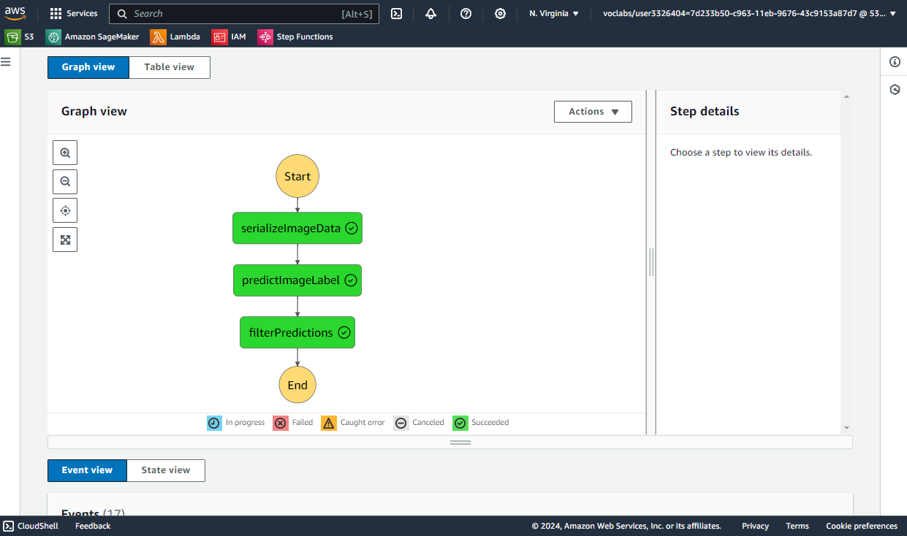
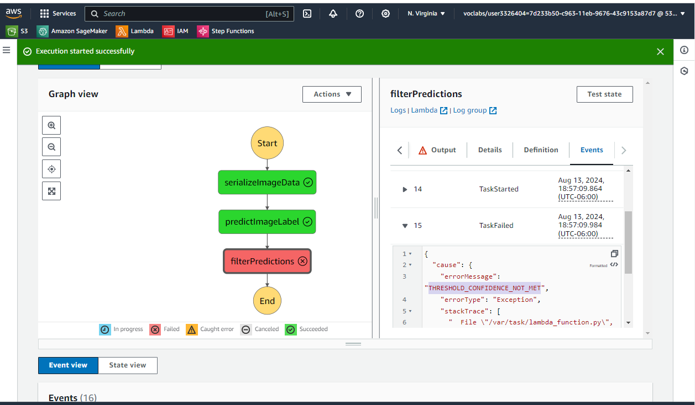
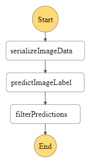

[![LinkedIn][linkedin-shield]][linkedin-url]

 

<h1 align="center">ML Workflow for Image Classification on AWS</h1>

  A serverless, self-monitoring image classification pipeline for Scones Unlimited — SageMaker for training and inference, Lambda + Step Functions for orchestration, and Model Monitor for drift/confidence tracking.
    
  <a href="https://github.com/DannyLCG/aws_scones_project"><strong>Browse the code »</strong></a>

---

  
Table of Contents

  <ol>
    <li><a href="#overview">Overview</a></li>
    <li><a href="#results">Results</a></li>
    <li><a href="#dataset">Dataset</a></li>
    <li><a href="#architecture--approach">Architecture & Approach</a></li>
    <li><a href="#built-with">Built With</a></li>
    <li><a href="#getting-started">Getting Started</a></li>
    <li><a href="#key-takeaways">Key Takeaways</a></li>
    <li><a href="#contact">Contact</a></li>
    <li><a href="#acknowledgments">Acknowledgments</a></li>
  </ol>

---

## Overview

Scones Unlimited is a scone-delivery-focused logistics company. The goal is to help Scones Unlimited optimize their operations. To achieve that goal, the company needs to deploy an image classification model that can automatically detect which kind of vehicle delivery drivers have, assigning delivery professionals who have a bicycle to nearby orders and giving motorcyclists orders that are farther away. This project builds the image classification model behind that routing decision — telling **bicycles** apart from **motorcycles** — and, more importantly, wraps it in the kind of event-driven, observable architecture a model needs before another system or team can depend on it.

Rather than a one-off training notebook, **the deliverable is an end-to-end ML workflow**: data staged in S3, a SageMaker image-classification model trained and deployed to a real-time endpoint, multiple chained **AWS Lambda** functions orchestrated by **AWS Step Functions**, and **SageMaker Model Monitor** capturing every request/response pair so degradation or drift can be caught after deployment — not just at training time.

This project was submitted as part of the **Udacity AWS Machine Learning Engineer Nanodegree** ("Build a Machine Learning Workflow for Scones Unlimited on Amazon SageMaker").

(<a href="#readme-top">back to top</a>)

---

## Results

The image-classification model, trained on only 1,000 labeled images, topped **0.8 validation accuracy**. That threshold was carried into production as the confidence gate in the `filterPredictions` Lambda: any inference below `0.8` fails the Step Function execution instead of silently passing a low-confidence label downstream.

Both outcomes were exercised end-to-end using the state machine below, fed with real payloads sampled from `./test`:

| Successful execution | Failed execution (confidence below threshold) |
|---|---|
|  |  |

Model Monitor's captured endpoint I/O was also used inside `starter.ipynb` to plot inference confidence over time and to render sampled input images next to their predicted labels — the visualization workflow a production team would build on to watch for drift.

(<a href="#readme-top">back to top</a>)

---

## Dataset

- **Source:** [CIFAR-100](https://www.cs.toronto.edu/~kriz/cifar.html), hosted by the University of Toronto
- **Filtered classes:** `bicycle` (fine label `8`) and `motorcycle` (fine label `48`) — remapped to binary labels `0`/`1` for training
- **Splits:** Train — 1,000 images (500 bicycle / 500 motorcycle) · Test — 200 images, stored locally under `train/` and `test/` as 32×32 PNGs
- **Format on disk:** raw pixel rows reshaped to 32×32×3 and saved as PNG, with `.lst` manifest files (`row`, `label`, `s3_path`) for SageMaker's image-classification input format

(<a href="#readme-top">back to top</a>)

---

## Architecture & Approach

**1. Data staging (ETL).** `starter.ipynb` downloads CIFAR-100, unpickles the `train`/`test`/`meta` archives, and filters down to just the `bicycle` (label `8`) and `motorcycle` (label `48`) classes. Each row's raw pixel bytes are reshaped into a 32×32×3 array and written out as a PNG (see `scripts/ImageDownload.py` and the `save_images`/`filter_dataset` helpers in the notebook). Images and their `.lst` manifest files are synced to S3 for training.

**2. Model training & deployment.** A SageMaker built-in `image-classification` algorithm is trained via the `Estimator` API on a single `ml.p3.2xlarge` instance (`image_shape=3,32,32`, `num_classes=2`, `num_training_samples=1000`), then deployed to a real-time endpoint on `ml.m5.xlarge`. `DataCaptureConfig` is attached at deploy time with 100% sampling, so every request and response the endpoint sees is written to S3 for **Model Monitor**.

**3. Serverless orchestration.** Three single-purpose Lambda functions (`scripts/LAMBDA/`) are chained together with **Step Functions** (`SconestateMachine_definition.json`):

| Lambda | Responsibility |
|---|---|
| `serializeImageData` | Downloads the target image from S3 and base64-encodes it for the payload |
| `predictImageLabel` | Invokes the SageMaker endpoint with the decoded image and attaches the raw inference probabilities |
| `filterPredictions` | Rejects the execution (raises `THRESHOLD_CONFIDENCE_NOT_MET`) unless the top inference probability clears `0.8` |

Each function's folder includes a matching JSON test event (e.g. `s3_input_image.json`, `imageSerializerOutput.json`, `predictImageLabelOutput.json`) so each step can be tested individually from the AWS Console before wiring them into the state machine — see `scripts/LAMBDA/README.md`.

**4. Monitoring.** Because the endpoint captures 100% of traffic, `starter.ipynb` pulls the JSONLines capture files back down (`S3Downloader` + `jsonlines`) and builds visualizations of inference confidence over time and sampled predictions — the basis for spotting model degradation without redeploying anything.

(<a href="#readme-top">back to top</a>)

---

## Built With

* [![Python][python-badge]][python-url]
* [![Jupyter][jupyter-badge]][jupyter-url]
* [![AWS][aws-badge]][aws-url]
* [![Pandas][pandas-badge]][pandas-url]
* [![NumPy][numpy-badge]][numpy-url]

**AWS services:** SageMaker (Estimator training, real-time endpoint, Model Monitor / Data Capture) · Lambda · Step Functions · S3 · IAM

(<a href="#readme-top">back to top</a>)

---

## Getting Started

Depending on the outcome, there are two ways to use this repo:
- **Tier 1** browses the workflow's artifacts locally — no AWS account needed — to inspect the code, sample data, and proof-of-execution screenshots.
- **Tier 2** reproduces the **full cloud pipeline** (training, deployment, Lambda + Step Functions orchestration, Model Monitor) and requires an AWS account, **which incurs cost**.

### Tier 1 — Browse the workflow locally (no AWS required)

This is a notebook-and-Lambda-driven AWS project rather than a standalone script, so there's no local inference path — but everything needed to understand and audit the workflow is in the repo:

- `starter.ipynb` — the full ETL → training → deployment → monitoring notebook
- `train/` and `test/` — the 1,000/200 filtered CIFAR-100 images used for training and as Step Function test payloads
- `scripts/LAMBDA/` — the three Lambda functions' source and their JSON test events
- `SconestateMachine_definition.json` — the Step Functions state machine definition
- `step_function_screenshot.png` / `step_function_fail_screenshot.png` / `stepfunctions_graph.png` — proof of a passing and a threshold-failing execution, plus the state machine graph

### Tier 2 — Reproduce the pipeline on AWS (AWS account required)

> **Prerequisites:** an AWS account, a SageMaker domain (Studio or a notebook instance) with an execution role, and an S3 bucket. Training jobs, the real-time endpoint, and Lambda/Step Functions invocations all incur cost.

1. Open `starter.ipynb` on a SageMaker notebook instance (tested on `ml.t3.medium`, `Python 3 (Data Science)` kernel) and run the ETL cells to stage data in your own bucket — swap `odlo-scones-bucket` for it.
2. Run the training and deployment cells to fit the `image-classification` estimator and deploy the endpoint with `DataCaptureConfig` enabled.
3. Deploy the three functions in `scripts/LAMBDA/` to AWS Lambda, updating the `ENDPOINT` constant in `predictImageLabel/lambda_function.py` to your deployed endpoint name. Use each folder's JSON file to test the function individually in the console.
4. Recreate the state machine from `SconestateMachine_definition.json` in Step Functions, replacing the Lambda ARNs (account ID / region / function names) with your own.
5. Generate test executions with `generate_test_case()` in the notebook, run them against the state machine, then pull the Model Monitor capture data back down to visualize inference confidence over time.

(<a href="#readme-top">back to top</a>)

---

## Key Takeaways

- **A confidence threshold turns a probabilistic output into a binary routing decision.** `filterPredictions` doesn't just pass data along — it fails the Step Function execution outright when the top inference is below `0.8`, so downstream systems only ever see predictions the pipeline is confident enough to act on.
- **Per-function JSON test fixtures make a chained pipeline debuggable.** Each Lambda folder ships the exact event shape it expects/produces, so any stage can be validated in isolation from the AWS Console before trusting the full state machine.
- **Data Capture removes the need for custom logging.** Attaching `DataCaptureConfig` at deploy time was enough to get 100% of endpoint I/O into S3 in JSONLines format, ready for the drift/confidence visualizations built in the notebook — no instrumentation code in the inference path itself.

(<a href="#readme-top">back to top</a>)

---

## Contact

Daniel Lopez — [LinkedIn](https://www.linkedin.com/in/o-daniel-lopez-2aa219310) — olopez@lcg.unam.mx

Project: [https://github.com/DannyLCG/aws_scones_project](https://github.com/DannyLCG/aws_scones_project)

(<a href="#readme-top">back to top</a>)

---

## Acknowledgments

* [Udacity AWS Machine Learning Engineer Nanodegree](https://www.udacity.com/course/aws-machine-learning-engineer-nanodegree--nd189) — "Build a Machine Learning Workflow for Scones Unlimited on Amazon SageMaker"
* [CIFAR-100 dataset](https://www.cs.toronto.edu/~kriz/cifar.html) — Krizhevsky, A. (2009), hosted by the University of Toronto

(<a href="#readme-top">back to top</a>)

---

<!-- BADGES -->
[linkedin-shield]: https://img.shields.io/badge/-LinkedIn-black.svg?style=for-the-badge&logo=linkedin&colorB=0A66C2
[linkedin-url]: https://www.linkedin.com/in/o-daniel-lopez-2aa219310

[python-badge]: https://img.shields.io/badge/Python-3776AB?style=for-the-badge&logo=python&logoColor=white
[python-url]: https://python.org

[jupyter-badge]: https://img.shields.io/badge/Jupyter-F37626?style=for-the-badge&logo=jupyter&logoColor=white
[jupyter-url]: https://jupyter.org

[aws-badge]: https://img.shields.io/badge/AWS-232F3E?style=for-the-badge&logo=amazonaws&logoColor=white
[aws-url]: https://aws.amazon.com

[pandas-badge]: https://img.shields.io/badge/Pandas-150458?style=for-the-badge&logo=pandas&logoColor=white
[pandas-url]: https://pandas.pydata.org

[numpy-badge]: https://img.shields.io/badge/NumPy-013243?style=for-the-badge&logo=numpy&logoColor=white
[numpy-url]: https://numpy.org
