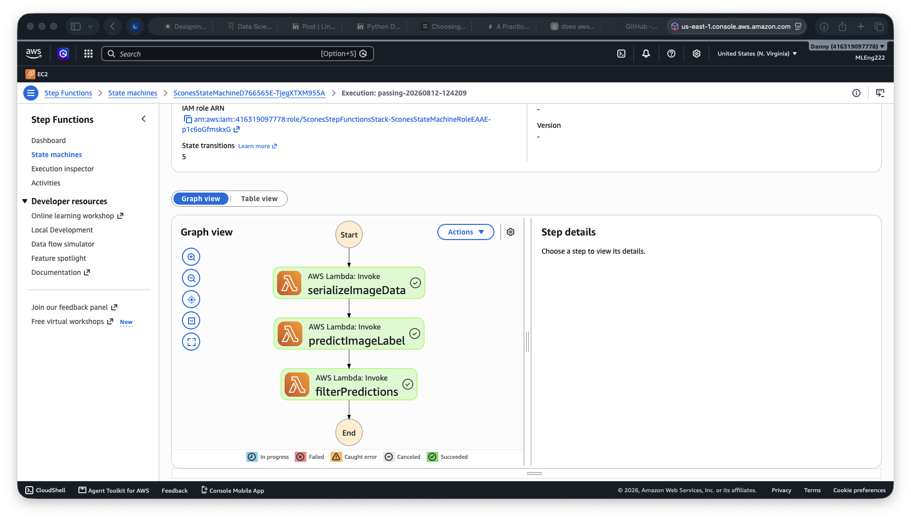
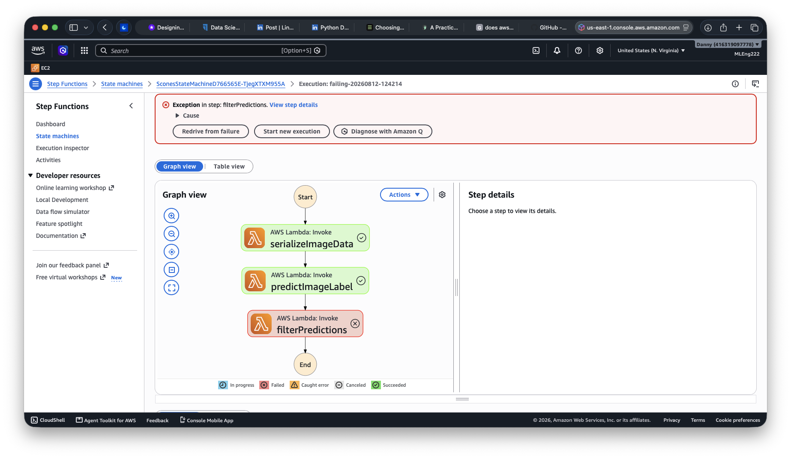
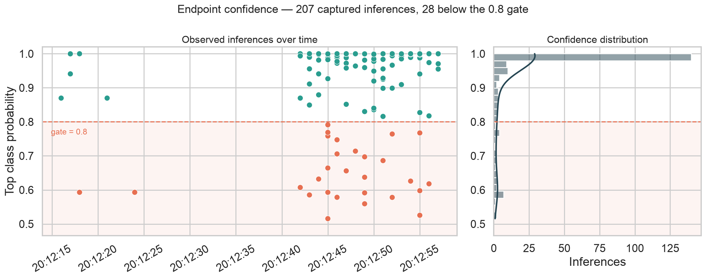
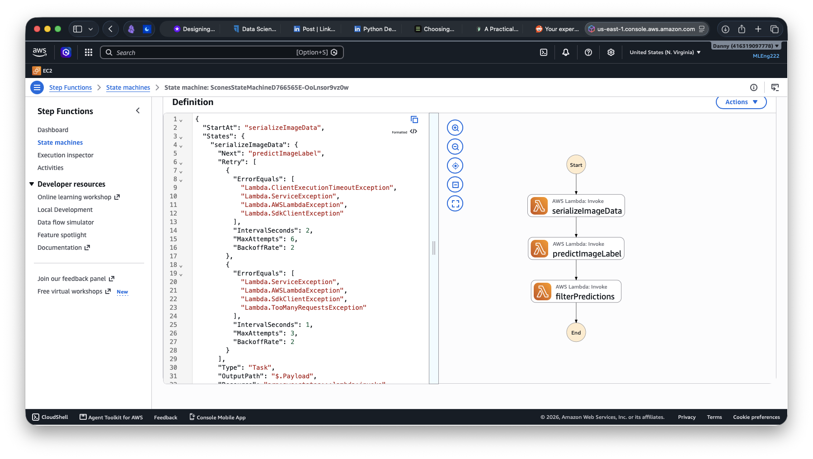
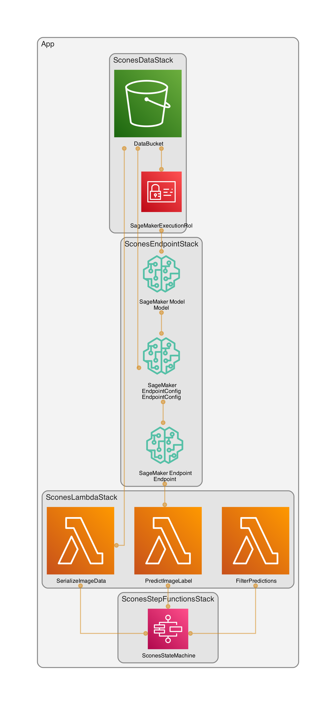

<a id="readme-top"></a>

[![LinkedIn][linkedin-shield]][linkedin-url]

<br />
<div align="center">

<h1 align="center">ML Workflow for Image Classification on AWS</h1>

<p align="center">
  A serverless, self-monitoring image classification pipeline for Scones Unlimited. SageMaker for training and inference, Lambda + Step Functions for orchestration, and Model Monitor for drift/confidence tracking.
  <br /><br />
  <a href="https://github.com/DannyLCG/aws_scones_project"><strong>Browse the code »</strong></a>
</p>
</div>

---

<details>
  <summary>Table of Contents</summary>
  <ol>
    <li><a href="#overview">Overview</a></li>
    <li><a href="#results">Results</a></li>
    <li><a href="#dataset">Dataset</a></li>
    <li><a href="#whats-in-the-repo">What's in the Repo</a></li>
    <li><a href="#architecture--approach">Architecture & Approach</a></li>
    <li><a href="#built-with">Built With</a></li>
    <li><a href="#reproduce-the-pipeline">Reproduce the Pipeline</a></li>
    <li><a href="#key-takeaways">Key Takeaways</a></li>
    <li><a href="#roadmap">Roadmap</a></li>
    <li><a href="#contact">Contact</a></li>
    <li><a href="#acknowledgments">Acknowledgments</a></li>
  </ol>
</details>

---

## Overview

Scones Unlimited is a scone-delivery-focused logistics company. The goal is to help Scones Unlimited optimize their operations. To achieve that goal, the company needs to deploy an image classification model that can automatically detect which kind of vehicle delivery drivers have, assigning delivery professionals who have a bicycle to nearby orders and giving motorcyclists orders that are farther away. **This project builds the image classification model** behind that routing decision — telling **bicycles** apart from **motorcycles** — and, more importantly, **wraps it in the kind of event-driven, observable architecture a model needs before another system or team can depend on it**.

Rather than a one-off training notebook, **the deliverable is an end-to-end ML workflow**: data staged in S3, a SageMaker image-classification model trained and deployed to a real-time endpoint, multiple chained **AWS Lambda** functions orchestrated by **AWS Step Functions**, and **SageMaker Model Monitor** capturing every request/response pair so degradation or drift can be caught after deployment — not just at training time.

The original submission was a single notebook. **Everything has since been rebuilt as infrastructure-as-code**: the Lambda functions, the endpoint, and the state machine are now defined in **AWS CDK** and created with one command, training runs from a script instead of a notebook cell, and the whole pipeline can be stood up and torn down on demand. That last part matters because a GPU-trained model behind a real-time endpoint is only affordable if one can destroy it when we're done.

*This project was originally submitted as part of the **Udacity AWS Machine Learning Engineer Nanodegree** ("Build a Machine Learning Workflow for Scones Unlimited on Amazon SageMaker"). `starter.ipynb` is kept in the repo as the record of that first version.*

<p align="right">(<a href="#readme-top">back to top</a>)</p>

---

## Results

The clip below summarizes the whole workflow: training the model, deploying the endpoint and the Lambda functions, feeding images through the pipeline, reading back what the endpoint recorded, and destroying everything that costs money. It takes about 45 minutes to run (the waiting is cut out).


The image-classification model, trained on only 1,000 labeled images, reached **0.8 validation accuracy**. That threshold was carried into production as the confidence gate in the `filterPredictions` Lambda function: any inference below `0.8` fails the Step Function execution instead of silently passing a low-confidence label downstream.

`scripts/run_executions.py` feeds a subsample of the test dataset until the state machine detects both successful and failed executions.

| Successful execution | Failed execution (confidence below threshold) |
|---|---|
|  |  |

Data Capture recorded every inference the endpoint served. Reading those records back with `scripts/analyze_capture.py` gives the inference confidence distribution view — not training metrics, but a visualization that a production team would use to watch for drift:

| Metric | Value |
|---|---|
| Captured inferences | 207 |
| Cleared the `0.8` gate | 179 |
| Rejected | 28 (13.5%) |
| Confidence range | 0.5156 – 1.0000 |
| Median confidence | 0.9992 |
| Predicted labels | 109 motorcycle / 98 bicycle |



*207 rather than 200 because `scripts/run_executions.py` had already sent 7 images through the endpoint while looking for one the model was confident about and one it wasn't.*

<p align="right">(<a href="#readme-top">back to top</a>)</p>

---

## Dataset

- **Source:** [CIFAR-100](https://www.cs.toronto.edu/~kriz/cifar.html), hosted by the University of Toronto
- **Filtered classes:** `bicycle` (fine label `8`) and `motorcycle` (fine label `48`) — remapped to binary labels `0`/`1` for training
- **Splits:** Train — 1,000 images (500 bicycle / 500 motorcycle) · Test — 200 images, stored locally under `data/train/` and `data/test/` as 32×32 PNGs
- **Format on disk:** raw pixel rows reshaped to 32×32×3 and saved as PNG, with `.lst` manifest files (`row`, `label`, `s3_path`) for SageMaker's image-classification input format

<p align="right">(<a href="#readme-top">back to top</a>)</p>

---

## What's in the Repo

A short map of where everything lives. The tests are the one part that runs without an AWS account:

- `docs/demo.gif` — the entire pipeline being built, run, and destroyed
- `infra/stacks/` — the CDK stacks: data, endpoint, Lambda functions, state machine
- `src/lambdas/` — the three Lambda functions, one folder each
- `scripts/` — data preparation, training, running the pipeline, reading back captured traffic
- `tests/` — unit tests with AWS mocked out: `uv run pytest tests/unit -q`
- `data/train/` and `data/test/` — the 1,000/200 filtered CIFAR-100 images
- `docs/architecture.png` — the infrastructure diagram, generated from the CDK app itself
- `starter.ipynb` — the original notebook version, kept as a record of where this started

<p align="right">(<a href="#readme-top">back to top</a>)</p>

---

## Architecture & Approach

**1. Data staging (ETL).** The 1,200 filtered CIFAR-100 images live in the repo, but SageMaker also needs a manifest telling it which class each image belongs to. `scripts/prepare_data.py` builds those manifests from CIFAR's own labels which turned out to be the most reliable approach since the filenames are descriptive rather than categorical: `velocipede` is a bicycle, `minibike` is a motorcycle, and `bike` shows up under **both**. Grouping by filename would quietly mislabel a handful of images. `scripts/train.py` then syncs the images and manifests to S3.

**2. Model training & deployment.** `scripts/train.py` runs SageMaker's built-in `image-classification` algorithm on a single GPU instance and writes the trained model back to S3. Training was deliberately done *outside* the infrastructure code since CloudFormation has no way to create a training job, so it belongs in a script rather than a stack. But the endpoint that serves the model *is* infrastructure, with **Data Capture** enabled so every request and response the endpoint sees is written to S3 without any logging code in the inference path. 

**3. Serverless orchestration.** Three single-purpose Lambda functions are chained together with **Step Functions**:



| Lambda | Responsibility |
|---|---|
| `serializeImageData` | Downloads the target image from S3 and base64-encodes it for the payload |
| `predictImageLabel` | Invokes the SageMaker endpoint with the decoded image and attaches the raw inference probabilities |
| `filterPredictions` | Rejects the execution (raises `THRESHOLD_CONFIDENCE_NOT_MET`) unless the top inference probability clears `0.8` |

Each function was tested on its own before any of it reaches AWS. `tests/fixtures/` holds real payloads captured from the running pipeline, the output of one function is the input to the next so the unit tests in `tests/unit/` assert against the shapes the functions actually exchange. Running them requires no AWS account.

**4. Monitoring.** Because the endpoint records 100% of its traffic, `scripts/analyze_capture.py` can read those records straight back out of S3 and plot how confident the model was on every inference it served. The confidence view shown in [Results](#results) **shows how confident the model was in production, so we can easily detect confidence drifting from the 0.8 validation threshold it shipped with.**.

### Infrastructure

Every component of the infrastructure was defined in AWS CDK under `infra/stacks/` .

*The data stack is persistent and nearly cost-free, while the endpoint, Lambda, and state machine stacks are deployed for a run and destroyed afterwards.*

[](docs/architecture.png)

*Generated from the CDK app itself using [`cdk-dia`](https://github.com/pistazie/cdk-dia). It reads the synthesized cloud assembly rather than a live account, so it stays accurate without anything deployed.*

Each line is a real CloudFormation export/import produced by passing constructs between stacks. 

<p align="right">(<a href="#readme-top">back to top</a>)</p>

---

## Built With

* [![Python][python-badge]][python-url]
* [![AWS][aws-badge]][aws-url]
* [![Pandas][pandas-badge]][pandas-url]
* [![NumPy][numpy-badge]][numpy-url]
* [![Jupyter][jupyter-badge]][jupyter-url]

**AWS services:** SageMaker (training jobs, real-time endpoint, Data Capture) · Lambda · Step Functions · S3 · IAM · CloudFormation

**Tooling:** AWS CDK (Python) for the infrastructure · boto3 for the training job · pytest + moto for tests that never touch AWS · uv for dependencies

<p align="right">(<a href="#readme-top">back to top</a>)</p>

---

## Reproducing the Pipeline

> **Prerequisites:** an AWS account, the [AWS CDK CLI](https://docs.aws.amazon.com/cdk/v2/guide/getting_started.html), and [uv](https://docs.astral.sh/uv/). No SageMaker domain or notebook instance needed — the pipeline is created from your terminal. A full run costs roughly **$0.30**: one GPU training job plus about half an hour of endpoint time.

- **Bootstrap the region (first-time only):**

*This step requires administrator permissions. If you don't have those, ask an administrator to run this command for you.*

```bash
cdk bootstrap aws://<account-id>/us-east-1 --termination-protection
```

**Why is this necessary?**

CDK does not deploy the infrastructure directly. It packages up your stack (files like Lambda code, plus the CloudFormation template it generates) and needs somewhere in your AWS account to stash that stuff and a trusted identity to act on your behalf while deploying it. The "bootstrapping" process sets up the necessary infrastructure for CDK to work - a staging bucket, an ECR repository, and IAM roles. This is done per region because those resources are regional, so any region you deploy into needs its own copy of this scaffolding before a `cdk deploy` can succeed there.

Something worth mentioning: Because the bootstrapping process creates IAM roles, AWS lists `iam:*` among [the minimum permissions the bootstrapping identity needs](https://docs.aws.amazon.com/cdk/v2/guide/bootstrapping-env.html#bootstrapping-env-permissions) so **there's no least-privilege version of this step**, and it's a one-time administrator task rather than something day-to-day deploys should be able to do.

- **Then, from the repo root:**

```bash
# 1. Deploy the Data Stack
# Leave this one up between runs, it costs about half a cent a month
# and it holds the trained model
cd infra && cdk deploy SconesDataStack && cd ..

# 2. Run the training job
# Uploads the images, runs the job, prints where the model is stored
uv run python scripts/train.py

# 3. Build the pipeline around that model: endpoint, Lambda functions, state machine. Paste the S3 path step 2 printed.
cd infra && cdk deploy SconesEndpointStack SconesLambdaStack SconesStepFunctionsStack \
  -c model_artifact=s3://.../model.tar.gz && cd ..

# 4. Serve the pipeline: sends a batch of images to the endpoint until you get a passing and a failing execution
uv run python scripts/run_executions.py

# 5. Read back what the endpoint recorded and draw the confidence plot
uv run python scripts/analyze_capture.py

# 6. Tear down everything that costs
cd infra && cdk destroy SconesStepFunctionsStack SconesEndpointStack SconesLambdaStack
```

Steps 1 and 2 only need repeating if you want a fresh model; steps 1–6 are the cycle the demo above shows. `scripts/prepare_data.py` regenerates the label manifests from CIFAR-100, but its output is committed, so you can skip it.

<p align="right">(<a href="#readme-top">back to top</a>)</p>

---

## Key Takeaways

- The project now presents the pipeline as full Infrastructure as Code (IaC), not only making it **easy to deploy and destroy**, but also to **version and share**.
- **A confidence threshold turns a probabilistic output into a binary routing decision.** `filterPredictions` doesn't just pass data along, it is designed to fail the Step Function execution whenever the inference is below `0.8`, so **downstream systems only ever see predictions the pipeline is confident enough to act on**.
- **Real captured payloads make a chained pipeline testable.** Every fixture in `tests/fixtures/` is an actual payload from the running pipeline, so the tests assert against the shapes the functions actually exchange rather than hand-written guesses — and they can run offline in under a second.
- **Data Capture removes the need for custom logging.** Switching it on at deploy time is enough to capture the production traffic with zero logging code in the inference path because Data Capture does it at the infrastructure layer. Essentially, it gets every request and response into S3, so drift detection doesn't depend on someone remembering to add a log line.
- **Infrastructure that can be destroyed is sustainable infrastructure.** Because the endpoint and everything around it are defined in CDK, deploying the pipeline requires a single command and removing it, another. Thanks to that, **this pipeline costs just a few cents (about $0.30) instead of risking to leave a GPU-backed endpoint running by accident, and with this safety is also practical to test the whole thing end to end, repeatedly**. 

<p align="right">(<a href="#readme-top">back to top</a>)</p>

---

## Future Opportunities


- **Automate retraining with SageMaker Pipelines.** The pipeline is deployed as infrastructure-as-code, but training still sits outside it (deliberately), since `AWS::SageMaker::TrainingJob` is registered with CloudFormation as **`NON_PROVISIONABLE`**, meaning no stack can create a training job. The native solution is to use `SageMaker Pipelines`: `AWS::SageMaker::Pipeline` *is* provisionable, so a CDK-defined pipeline can chain training → evaluation → model registration, **with the endpoint stack deploying whichever model version gets approved in the Model Registry.** This is the pattern AWS's own [`cdk-pipelines-deploy-sagemaker-endpoint`](https://github.com/aws-samples/cdk-pipelines-deploy-sagemaker-endpoint) sample uses: CDK owns the endpoint, the registry owns the artifact, and approval events trigger deployment.
- **Schedule Model Monitor and alarm on prediction drift**. The endpoint already captures 100% of traffic, so a useful addition would be to schedule Model Monitor against the output distribution and wire a CloudWatch alarm on Prediction drift (confidence degradation). 
- **Detecting data drift.** [Model Monitor computes statistics on tabular data only](https://docs.aws.amazon.com/sagemaker/latest/dg/model-monitor.html). For an image-classification endpoint its built-in monitors can baseline the *output probabilities but not the image inputs*. So in case we want to know whether incoming images resemble the training distribution, there's no way to baseline those images. **Closing that gap means a custom monitoring container that computes image-level statistics** (e.g., embedding or pixel-histogram distributions) against a training-set baseline.
- **Generate drift reports with [Evidently](https://www.evidentlyai.com/ml-monitoring) once the endpoint sees sustained traffic.** Evidently is an open-source standard for ML observability. The downside is that it compares a reference dataset against a current one using statistical tests. Given the couple of hundred inferences this project generates over time, that tool would be overkill since those tests would report noise rather than drift. It its worth using it when we have a real traffic history to compare against, not before.
- **Add CI:** run the unit tests and `cdk synth` on every push, so infrastructure changes are validated before they ever reach AWS.

<p align="right">(<a href="#readme-top">back to top</a>)</p>

---

## Contact

Daniel Lopez — [LinkedIn](https://www.linkedin.com/in/o-daniel-lopez-2aa219310) — olopez@lcg.unam.mx

Project: [https://github.com/DannyLCG/aws_scones_project](https://github.com/DannyLCG/aws_scones_project)

<p align="right">(<a href="#readme-top">back to top</a>)</p>

---

## Acknowledgments

* [Udacity AWS Machine Learning Engineer Nanodegree](https://www.udacity.com/course/aws-machine-learning-engineer-nanodegree--nd189) — "Build a Machine Learning Workflow for Scones Unlimited on Amazon SageMaker"
* [CIFAR-100 dataset](https://www.cs.toronto.edu/~kriz/cifar.html) — Krizhevsky, A. (2009), hosted by the University of Toronto

<p align="right">(<a href="#readme-top">back to top</a>)</p>

---

<!-- BADGES -->
[linkedin-shield]: https://img.shields.io/badge/-LinkedIn-black.svg?style=for-the-badge&logo=linkedin&colorB=0A66C2
[linkedin-url]: https://www.linkedin.com/in/o-daniel-lopez-2aa219310

[python-badge]: https://img.shields.io/badge/Python-3776AB?style=for-the-badge&logo=python&logoColor=white
[python-url]: https://python.org

[jupyter-badge]: https://img.shields.io/badge/Jupyter-F37626?style=for-the-badge&logo=jupyter&logoColor=white
[jupyter-url]: https://jupyter.org

[aws-badge]: https://img.shields.io/badge/AWS-232F3E?style=for-the-badge&logo=amazonaws&logoColor=white
[aws-url]: https://aws.amazon.com

[pandas-badge]: https://img.shields.io/badge/Pandas-150458?style=for-the-badge&logo=pandas&logoColor=white
[pandas-url]: https://pandas.pydata.org

[numpy-badge]: https://img.shields.io/badge/NumPy-013243?style=for-the-badge&logo=numpy&logoColor=white
[numpy-url]: https://numpy.org
